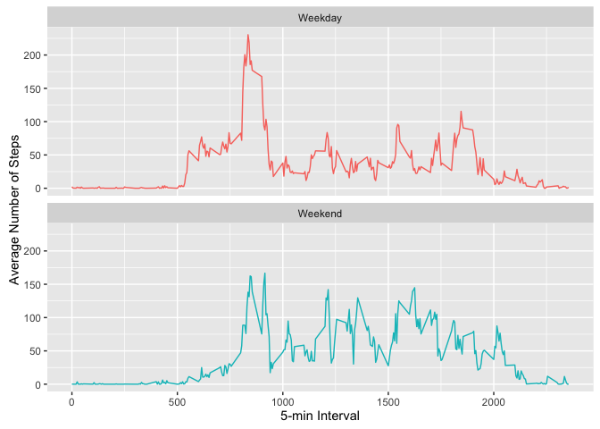

# Reproducible Research: Peer Assessment 1


## Loading and preprocessing the data

Global options were set to round all calculations to one decimal digit and the 
threshold for scientific notation was increased.  As the measured variable is an 
integer (counting steps) further decimal places would be uninformative. 

The dataset is unzipped if the  csv file is not present. Then the data is stored 
in a variable called fitdata.  The date column is converted from a factor to a 
date class.  


```r
options(scipen = 8, digits = 1)
if (!file.exists("activity.csv")){
        unzip("activity.zip")
}
fitdata <- read.csv("activity.csv")
fitdata$date <- as.Date(fitdata$date, "%Y-%m-%d")
```

## What is mean total number of steps taken per day?

First totals were calculated of the steps variable by date, ignoring missing 
values, and stored into the sums variable.  A histogram of the totals was 
created.  Missing data was ignored.


```r
sums <- aggregate(fitdata$steps, by = list(fitdata$date), sum, na.rm = TRUE)

library(ggplot2)
ggplot(sums, aes(x)) + 
        geom_histogram(bins = 10, col = "grey", fill = "steelblue") +
        labs(title = "Total Steps per Day") +
        labs(x = "Total Steps") +
        labs(y = "Number of Days")
```

<!-- -->

Then the mean and medians are calculated.


```r
mean1 <- mean(sums[ ,2])
median1 <- median(sums[ ,2])
```

The average total number of steps is 9354.2 and the median is 10395.

## What is the average daily activity pattern?

First the mean number of steps across all days for each time interval were 
calculated.  This was plotted against the 5-min intervals to show the average 
change in activity over the course of a day.  Missing data was ignored.


```r
means <- aggregate(fitdata$steps, list(fitdata$interval), mean, na.rm = TRUE)
colnames(means) <- c("Interval", "Steps")
ggplot(means) +
        geom_line(aes(Interval, Steps),col = "indianred") +
        labs(y = "Average Number of Steps") + 
        labs(x = "5-minute Interval") +
        labs(title = "Average Daily Activity")
```

<!-- -->

The maximum average step value was calculated and the associated interval
reported.  


```r
stepmax <- max(means$Steps)
interval1 <- means$Interval[means$Steps == stepmax]
```

The time interval during which the highest number of steps on average were 
recorded is the 835 minute interval at an average of 206.2 
steps.

## Imputing missing values

The number of missing values is calculated.

```r
nas1 <- sum(is.na(fitdata$steps))
```

There are 2304 missing values.

I chose to replace missing values with the mean number of steps at that time 
interval. First the data was split by interval, then missing values were 
replaced with the column mean.  (The function na.gam.replace replaces missing 
value with a funcion of the column, with mean being the default.)  The data 
was split first to allow the replacement function to be used as is (without
subsets by interval).  Then the data was recombined.


```r
library(gam)
```

```
## Loading required package: splines
```

```
## Loading required package: foreach
```

```
## Loaded gam 1.12
```

```r
filldata <- split(fitdata, fitdata$interval)
filldata <- lapply(filldata, na.gam.replace)
filldata <- unsplit(filldata, fitdata$interval)
```

Analysis from the mean total section was re-run to examine the effects of 
replacing missing values on the totals. The same code with the corresponding 
variable names was used for consistency.


```r
fillsums <- aggregate(filldata$steps, by = list(filldata$date), sum, na.rm = TRUE)
ggplot(fillsums, aes(x)) + 
        geom_histogram(bins = 10, col = "grey", fill = "steelblue") +
        labs(title = "Total Steps per Day") +
        labs(x = "Total Steps") +
        labs(y = "Number of Days")
```

<!-- -->

Then the mean and medians are calculated.


```r
mean2 <- mean(fillsums[ ,2])
median2 <- median(fillsums[ ,2])
```

The mean and median of the data with NA's replaced is 10766.2 and 10766.2,
respectively.

Because missing values were omitted previously, replacing missing values 
increased the total steps for every day in which missing values were present,
affecting the distribution of the data, the mean, and the median.  The largest 
change in the distribution is that there are far fewer 0 value totals, and as a
result the distrabution appears more bell curve-like with the substitutions.

## Are there differences in activity patterns between weekdays and weekends?

A function was created to determine if a date was a weekday or a weekend.
Then a column was added to the dataset with the results of applying the 
function to the date of the data.  

```r
weekend <- function(x) {
        ifelse(weekdays(x) == "Saturday"|weekdays(x) == "Sunday",
               "Weekend","Weekday")
}

library(dplyr)
```

```
## 
## Attaching package: 'dplyr'
```

```
## The following objects are masked from 'package:stats':
## 
##     filter, lag
```

```
## The following objects are masked from 'package:base':
## 
##     intersect, setdiff, setequal, union
```

```r
filldata <- mutate(filldata, day = weekend(date))
filldata$day <- as.factor(filldata$day)
```

The means were calculated for each interval on the weekday and weekends, then
plotted.


```r
wmeans <- aggregate.data.frame(filldata$steps, list(filldata$interval, filldata$day), "mean")
colnames(wmeans) <- c("interval", "day", "steps")
ggplot(wmeans) +
        geom_line(aes(interval, steps, color = day)) +
        facet_wrap(~day, ncol = 1, nrow = 2) +
        guides(color = FALSE) +
        labs(x = "5-min Interval", y = "Average Number of Steps")
```

<!-- -->

