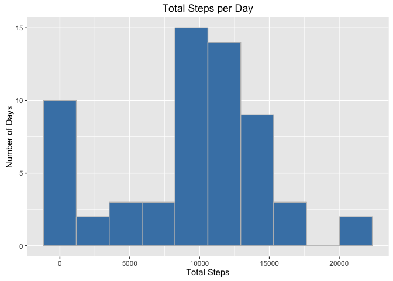
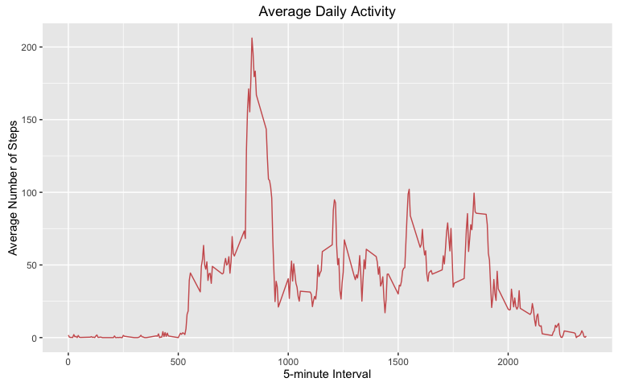
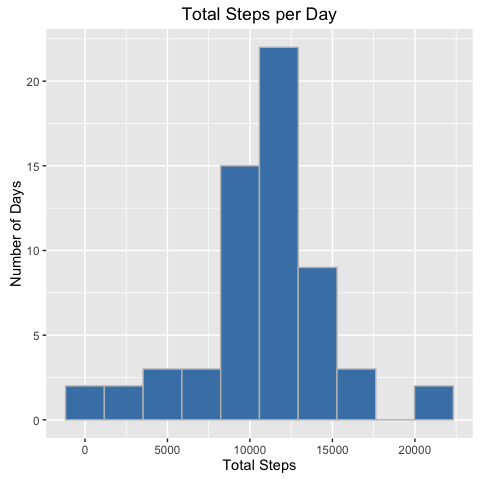

# Reproducible Research: Peer Assessment 1


## Loading and preprocessing the data

First, the dataset is unzipped if the csv file is not present.  Then the data
is stored in a variable called fitdata.  The date column is converted from a 
factor to a date class.


```r
if (!file.exists("activity.csv")){
        unzip("activity.zip")
}
fitdata <- read.csv("activity.csv")
fitdata$date <- as.Date(fitdata$date, "%Y-%m-%d")
```

## What is mean total number of steps taken per day?

First totals were calculated of the steps variable by date, ignoring missing 
values, and stored into the sums variable.  A histogram of the totals was 
created.


```r
sums <- aggregate(fitdata$steps, by = list(fitdata$date), sum, na.rm = TRUE)

library(ggplot2)
ggplot(sums, aes(x)) + 
        geom_histogram(bins = 10, col = "grey", fill = "steelblue") +
        labs(title = "Total Steps per Day") +
        labs(x = "Total Steps") +
        labs(y = "Number of Days")
```

<!-- -->

Then the mean and medians are calculated.


```r
mean(sums[ ,2])
```

```
## [1] 9354.23
```

```r
median(sums[ ,2])
```

```
## [1] 10395
```

## What is the average daily activity pattern?

First the mean number of steps across all days for each time interval were 
calculated.  This was plotted against the 5-min intervals to show the average 
change in activity over the course of a day.


```r
means <- aggregate(fitdata$steps, list(fitdata$interval), mean, na.rm = TRUE)
colnames(means) <- c("Interval", "Steps")
ggplot(means) +
        geom_line(aes(Interval, Steps),col = "indianred") +
        labs(y = "Average Number of Steps") + 
        labs(x = "5-minute Interval") +
        labs(title = "Average Daily Activity")
```

<!-- -->

The maximum average step value was calculated and the associated interval
reported.


```r
stepmax <- max(means$Steps)
means$Interval[means$Steps == stepmax]
```

```
## [1] 835
```

## Imputing missing values

The number of missing values is calculated.

```r
sum(is.na(fitdata$steps))
```

```
## [1] 2304
```

I chose to replace missing values with the mean number of steps at that time 
interval. First the data was split by interval, then missing values were 
replaced with the column mean.  (The function na.gam.replace replaces missing 
value with a funcion of the column, with mean being the default)


```r
library(gam)
```

```
## Loading required package: splines
```

```
## Loading required package: foreach
```

```
## Loaded gam 1.12
```

```r
filldata <- split(fitdata, fitdata$interval)
filldata <- lapply(filldata, na.gam.replace)
filldata <- unsplit(filldata, fitdata$interval)
```

Analysis from the mean total was re-run to examine the effects of replacing
missing values on the totals. 


```r
fillsums <- aggregate(filldata$steps, by = list(filldata$date), sum, na.rm = TRUE)
ggplot(fillsums, aes(x)) + 
        geom_histogram(bins = 10, col = "grey", fill = "steelblue") +
        labs(title = "Total Steps per Day") +
        labs(x = "Total Steps") +
        labs(y = "Number of Days")
```

<!-- -->

Then the mean and medians are calculated.


```r
mean(fillsums[ ,2])
```

```
## [1] 10766.19
```

```r
median(fillsums[ ,2])
```

```
## [1] 10766.19
```

Because missing values were omitted previously, replacing missing values 
increased the total steps for every day in which missing values were present.

## Are there differences in activity patterns between weekdays and weekends?
